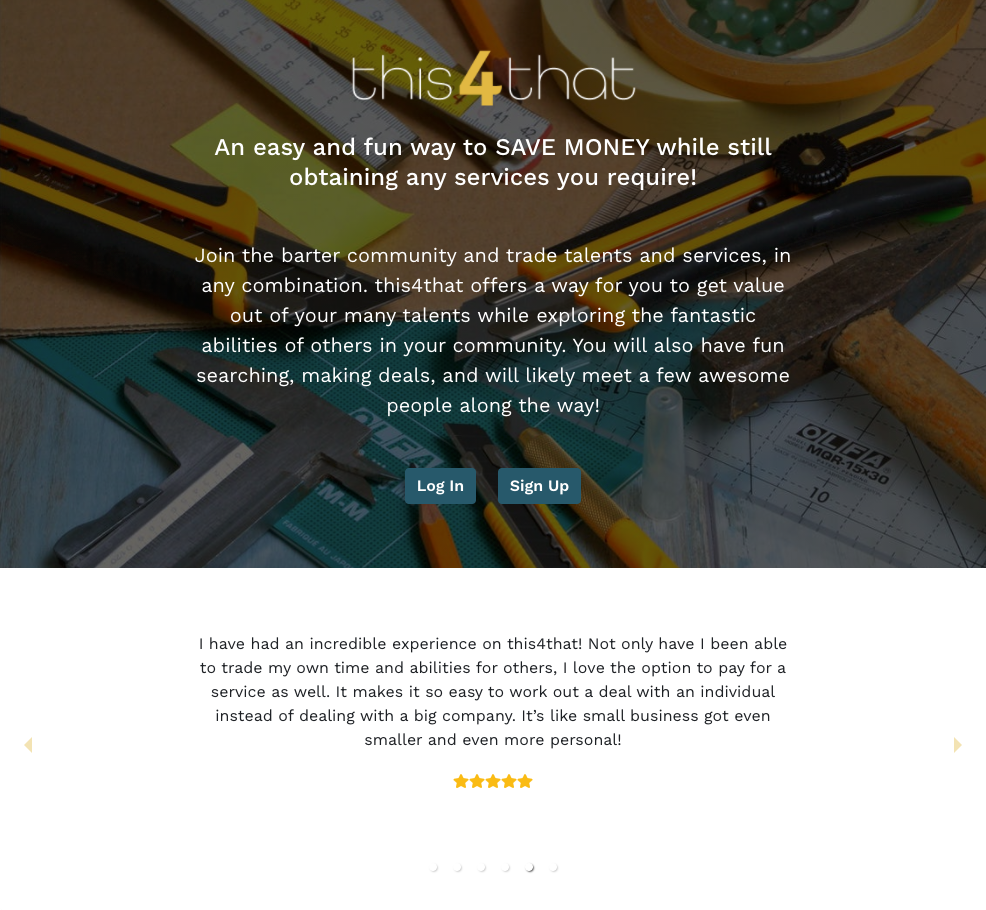

# this4that

this4that is an easy and fun way to SAVE MONEY while still obtaining any services you require!  Join the barter community and trade talents and services, in any combination.
this4that offers a way for you to get value out of your many talents while exploring the fantastic abilities of others in your community.  You will also have fun searching, making deals, and will likely meet a few awesome people along the way! <a href="https://peaceful-ocean-96286.herokuapp.com/">Check out this4that deployed on Heroku.</a>

## Table of Contents
* [Description](#description)
* [Installation](#installation)
* [Technologies](#technologies)
* [Features](#features)
* [Contributing Authors](#contributors)
* [License](#license)

# Description

this4that is a mobile-first bartering application which allows users to exchange their services and skills with one another. Users have the option to barter directly with one another for a fair exchange of services or users can pay others directly using Paypal. 

## Technologies

Created using React with a Mongo database, Mongoose schema, and Express to handle routes. User authentication handled by Auth0, chat feature using socket.io, styled with Bootstrap, and payment options connected to PayPal.
    
## Features

* Authentication using Auth0 allows users to login with their Google credentials.

* Users can set up profiles with their information, including a bio, skills for trade, and distance willing to travel.

* Users can browse for users and search by skill.

* Gives users the opportunity to barter directly with one another via a chat option or to pay others for services.

* Users are able to leave reviews for barter or service exchanges from others.

# Contributing Authors

* Natasha Harrington: Auth0, Express, Mongoose, ReactRouter: Set up server and front and back end API routes. Authentication w/Auth0 and routing with ReactRouter. Set up basic boilerplate for models/mongoose Backend code for the edit profile form and for the review form. Deployed site.

* Ashley Hunt: Wireframing, User Flow, UX/UI, Branding, Bootstrap, Custom CSS, Javascript React Slider

* Eddie Villarreal: messaging component,  packages  socket.io "server side",   socket.io-client "client side",  set up socket server, set up functions on client side to connect to open sockets on server to send and receive messages though said sockets 

* Casandra Cutter: payment functionality, contributed to search functionality, set up seed data, general team support
    
# License
MIT